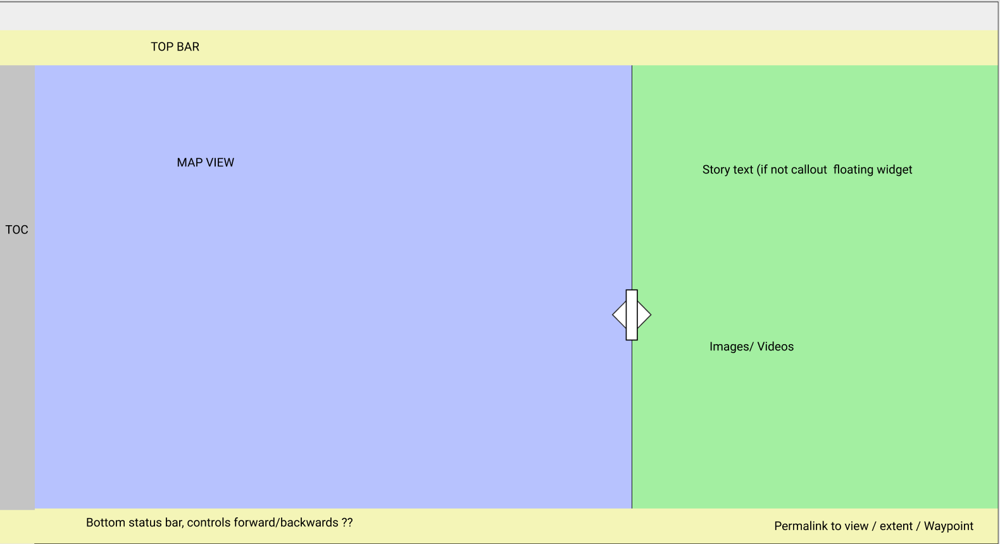

# MVC design: data flow, user actions

## Story data structure

Currently, the data structure to represent the stories is (`example_gare#data-structure-v2`):
```json
{
  "title": "The Story Title",
  "thumbnail": "an image to show in the list of stories in the entry-page",
  "map": {
    "layer": {
      "path": "/path/to/wtms/mars",
      "type": "tms"
    },
    "extent": [xmin, ymin, xmax, ymax],
  },

  "episodes": [
    {
      "title": "episode title",
      "thumbnail": "a small image to show in the list of episodes",
      "text": "some text, something 300~500 should be ok",
      "media": [
        {
          "path": "/some/path/to/image.png",
          "type": "image/png"
        },
        {
          "path": "https://youtube.com/some-video",
          "type": "video/youtube"
        },
        {
          "path": "/some/path/to/mesh.glb",
          "type": "model/gltf-binary"
        }
      ],
      "map": {
        "layer": {
          "path": "/some/path/to/features.json",
          "type": "application/json"
        },
        "extent": [xmin, ymin, xmax, ymax],
        "marker": [x, y]
      }
    },
    {
      ...
    }
  ]
}
```
, represented by a JSON file. In the file, all the information regarding *the story*
should be found (this is the _model_).

Not every field is mandatory:
* All fields from the top level ("title, thumbnail, map:*") are mandatory.
* "episodes"
  * "map": optional; if _not_ specified, use from last episode; `null` will clean it.
    * "layer": optional; if layer _is_ specified, so should be `path` and `type`.
      * "path": local filename (relative to root) or remote url.
      * "type": options are `geojson`, `wms`, `wfs`.
    * "extent": optional; if specified, define the map viewport, otherwise use last episode's.
    * "marker": optional; when specified, highlights marker in the map.
  * "title": mandatory.
  * "thumbnail": mandatory.
  * "text": mandatory.
  * "media": optional.

It is the app's responsibility to display the story content in a proper layout
(this is the _view_) and control the actions of the user by properly routing data
to display and vice-versa (the _controller_).
For instance, the app will associate a _body_ and a _URL_ to each story,
* a body: Mars, Mercury, Moon
* a URL: e.g., "https://stories.planmap.eu/mars/the_gale_crater"

## Web interface

Overall, the app will layout as follows (top-to-bottom, left-to-right):
* a Top menu bar
* a Table of Contents displaying the running story list of episodes
* a Map view displaying the Leaflet map
* a Story panel displaying the episodes content (title, text, media)
* a Footbar displaying basic controls



## Workflow

Let's consider the server hostname `HOST=storymap.planmap.eu`, the storymap
base url will be `BASEURL=http://$HOST`.

### Entry page

When a user access `$BASEURL` an page with all the stories should be presented.
Since stories are organized after the celestial body (planet or satellite;
Mars, Mercury, Moon), the page may display the stories in sections accordingly:
```
/ # Entry page
├── mars # MARS ENTRY PAGE with list of stories
│   ├── story-name
│   ├── [...]
│   └── gale
├── mercury # MERCURY ENTRY PAGE with list of stories
│   ├── hokusai
│   └── ...
└── moon # MOON ENTRY PAGE with list of stories
    └── ...
```

```diff
- Figure of entry page with list of stories under body sections
```

Each story displayed is a link to the corresponding storymap page.
The link is a _route_ URL, for instance, `/mars/gale`.
In general, storymap URLs may be represented as `STORYURL=$BASEURL/$BODY/$STORYLABEL`.

The list of stories at the entry page is rendered by buttons with the stories title,
corresponding thumbnail and URL.

Entry page story buttons:
```
text: story title
img: story-icon
href: story-url
```

> The name of the stories, `STORYLABEL`, should be URL-friendly which means no
> special characters or white-spaces. `STORYLABEL` should be a field in the story descriptor.

#### View input
The entry page HTML/JS code receives an object where _keys_ and _values_ are
as follows:

> The data object will be called `stories_data`. For now, let us consider
> `stories_data` a data object only, without methods for accessing the data.
> It looks useful to structure a class in the next version of this document,
> but for the sake of simplicity we will now avoid it.

```javascript
[
  {
    body: 'mars',
    stories: [
      {
        title: 'The Gale crater',
        label: 'gale-crater',
        thumbnail: '/path/to/story/thumbnail.png';
        storymap: {...}
      },
      {
        title: 'Another story for Mars',
        label: 'another-story-mars',
        storymap: {...}
      }
    ]
  },
  {
    body: 'mercury',
    stories: [
      {
        title: ...,
        label: ...,
        storymap: {...}
      }
    ]
  },
  {
    body: 'moon',
    stories: [...]
  }
]
```

#### View action

Considering the App is going to use a _route_ resolver, if the view triggers a
_link_ to `STORYURL` the next page will be called by the router; no explicit
callbacks are necessary here.


### Story-map page

When a page `STORYURL` is accessed the story corresponding to `BODY/STORYNAME`
is build.

> The data object `stories_data` containing _all_ body/stories is provided as
> a global object, when `STORYURL` is going to be rendered that is what is
> has to handle.

From `BODY` and `STORYNAME` values the page script called by the _router_ searches
for the corresponding story inside `stories_data` (pseudo-code):
```
in 'stories_data' get 'STORYNAME' from 'BODY' and allocate it to 'storymap_data'
```

The data object `storymap_data` has all the information to set the (Leaflet) map
and story episodes at hand. No subpages or routings exist under a story-map.

> The `storymap_data` object is the one described at the (first) section
> [#story-data-structure] of this document.

The `storymap_data` fields will be used as follows:
* `title`: set the story title at the top bar;
* `thumbnail`: of no use in here;
* `map`: send to a "leafletMap" object, together with the `div` element `id` to build the map,
  * the "leafletMap" object is accessible in the page context for programmatic actions;
* `episodes`: build the `TOC` list of stops,
  * the first episode is active from the start, when the story/page is rendered.

In the page context there is a variable `episode_index` with the current, active
episode index (or order) being displayed.
At the start, episode index '0' is active.


#### View input

##### TOC, '< | >' elements

The list of episodes in the left -- `TOC` -- display the episode `thumbnail`,
`title` and `order`.

##### Episode panel

At the right side of the screen there is the "episode panel" (I don't like this
name either, but it does the job for the moment).
The panel display the current episode's:
* `title`
* `text`
* `media` (optional, may be `undefined`)
  * can be one or a set of images, a youtube video, or 3D objects;
  * For figures and 3D objects a "maxime" button for a greater/better view in an overlay.

##### Media overlay

**TBD:** figures and 3D objects can be maximize out from the episode panel to an
overlay on top of the (leaflet) map.
For figures it means just a better view, for 3D meshes it means the actual
interactive `canvas`.


#### View action

```diff
- TODO: Define page controller.
+ Page controller method in need: `setEpisode(order) { leafletMap.set(map-data); episodePanel.set(episode-data)}`
```

##### TOC, '< | >' elements

When an item from `TOC` is toggled, `TOC` sends the correponding `order` value
to the page controller.
Analogously, when the "next-episode" or "previous-episode" buttons are toggled
the corresponding ("next" or "previous") index/order is sent to the controller.

##### Episode panel

The only component in the panel allowed to have action associated to is the `media`:
* if multiple multiple figures, a "carrousel" (or alike) container is to used;
* if a youtube, the video will be embeded (through `iframe`) and youtube controls available;

> Should 3D meshes be interactive when in the (small) media panel?

##### Media overlay

The overlay does not trigger actions outside it.
For multiple figures it provides the "carrousel" like in the (right) panel.
For 3D meshes it is an interactive (3D) `canvas`.
