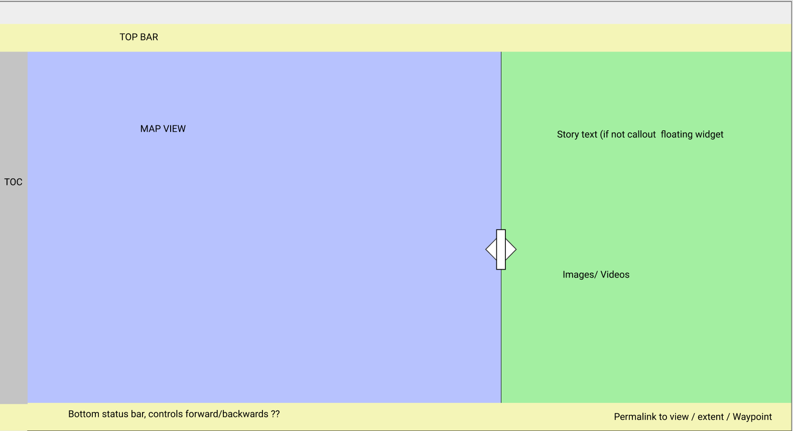

# MVC design: data flow, user actions

Currently, the data structure to represent the stories is (`example_gare#data-structure-v2`):
```json
{
  "title": "The Story Title",
  "thumbnail": "a small image to show in the list of stories",
  "map": {
    "layer": {
      "path": "/path/to/wtms/mars",
      "type": "tms"
    },
    "extent": [xmin, ymin, xmax, ymax],
  },

  "episodes": [
    {
      "title": "episode title",
      "thumbnail": "a small image to show in the list of episodes",
      "text": "some text, something 300~500 should be ok",
      "media": [
        {
          "path": "/some/path/to/image.png",
          "type": "image/png"
        },
        {
          "path": "https://youtube.com/some-video",
          "type": "video/youtube"
        },
        {
          "path": "/some/path/to/mesh.glb",
          "type": "model/gltf-binary"
        }
      ],
      "map": {
        "layer": {
          "path": "/some/path/to/features.json",
          "type": "application/json"
        },
        "extent": [xmin, ymin, xmax, ymax],
        "marker": [x, y]
      }
    },
    {
      ...
    }
  ]
}
```
, represented by a JSON file. In the file, all the information regarding *the story*
should be found (this is the _model_).

Not every field is mandatory:
* All fields from the top level ("title, thumbnail, map:*") are mandatory.
* "episodes"
  * "map": optional; if _not_ specified, use from last episode; `null` will clean it.
    * "layer": optional; if layer _is_ specified, so should be `path` and `type`.
      * "path": local filename (relative to root) or remote url.
      * "type": options are `geojson`, `wms`, `wfs`.
    * "extent": optional; if specified, define the map viewport, otherwise use last episode's.
    * "marker": optional; when specified, highlights marker in the map.
  * "title": mandatory.
  * "thumbnail": mandatory.
  * "text": mandatory.
  * "media": optional.

It is the app's responsibility to display the story content in a proper layout
(this is the _view_) and control the actions of the user by properly routing data
to display and vice-versa (the _controller_).
For instance, the app will associate a _body_ and a _URL_ to each story,
* a body: Mars, Mercury, Moon
* a URL: e.g., "https://stories.planmap.eu/mars/the_gale_crater"

## Web interface

Overall, the app will layout as follows (top-to-bottom, left-to-right):
* a Top menu bar
* a Table of Contents displaying the running story list of episodes
* a Map view displaying the Leaflet map
* a Story panel displaying the episodes content (title, text, media)
* a Footbar displaying basic controls



## Simulation
